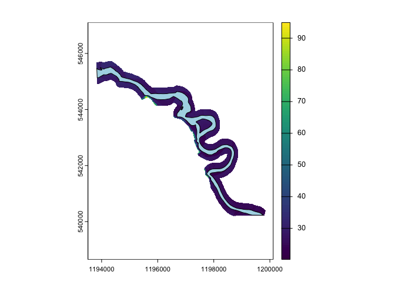
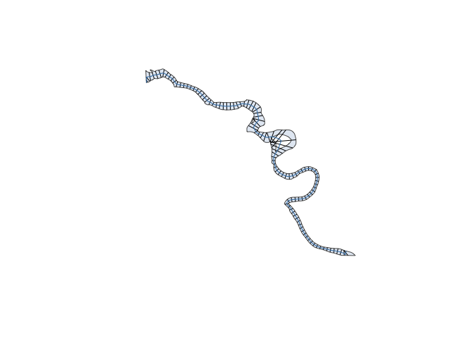
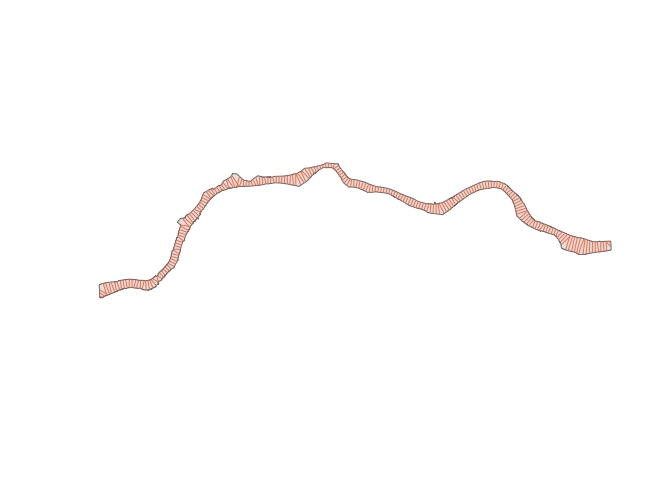
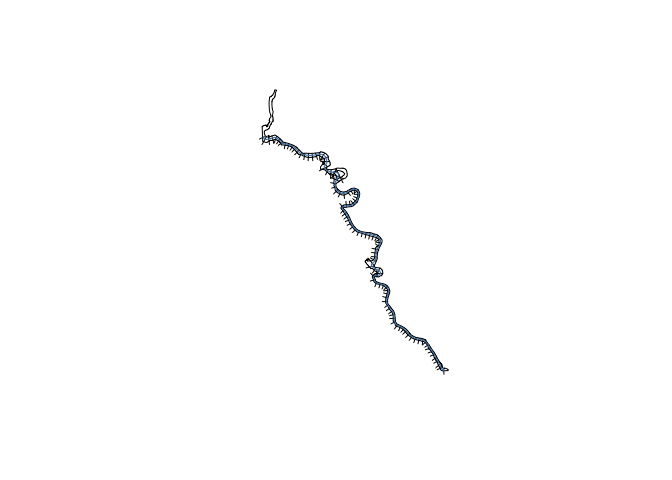
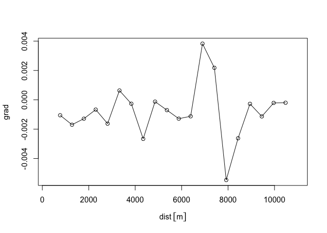

<!-- README.md is generated from README.Rmd. Please edit that file -->

# xchan <a href="https://fluvtools.github.io/xchan/"></a>

<!-- badges: start -->

[](https://lifecycle.r-lib.org/articles/stages.html#stable)
[](https://github.com/fluvtools/xchan/actions/workflows/R-CMD-check.yaml)
[](https://app.codecov.io/gh/fluvtools/xchan)
<!-- badges: end -->

The purpose of xchan is to create, widen (erode), and calculate
attributes of watercourse geometries. It does this by encoding a channel
by its cross sections, which can be planimetric (line segments arranged
on a map) or profile (slices into the landscape).

The package concept is inspired by the
[**sf**](https://r-spatial.github.io/sf/) package, because xchan encodes
both cross section objects (`xsection`) and whole channels (`xchan`),
which are simply a list of cross sections. Most functions in xchan start
with a common prefix, `xt`, in parallel with the sf package’s function
prefix, `st`. The `x` stands for “cross” or “cross section”.

## Statement of Need

Many geomorphic workflows rely on cross sections, but the surrounding
tasks are often pieced together from ad hoc scripts: building channels
from banklines, attaching surveyed or DEM-derived profiles, widening
channels, and calculating attributes such as width, elevation, and
gradient.

`xchan` provides a consistent cross-section-first workflow for those
tasks in R. It is designed to make channel geometry easier to build,
modify, and analyze in a reproducible way.

## Target Audience

`xchan` is aimed at river scientists, geomorphologists, and other
analysts working with banklines, cross sections, channel surveys, and
DEMs. It is most useful when channel geometry needs to be created,
modified, or compared across many sections.

## Installation

You can install the development version of xchan from
[GitHub](https://github.com/fluvtools/xchan) with:

``` r
# install.packages("devtools")
devtools::install_github("fluvtools/xchan")
```

## Example

The package includes spatial data for the Squamish River in British
Columbia: a bankline polygon and a DEM. It’s possible to create channels
in other ways; see the [*Getting Started with
Channels*](https://fluvtools.github.io/xchan/articles/basic_channels.html)
and [*Channels with
Profiles*](https://fluvtools.github.io/xchan/articles/channels_with_profiles.html)
vignettes for more information.

Start by loading the package and unwrapping the packaged DEM, and
plotting the bankline polygon on top.

``` r
library(xchan)
library(terra)
#> terra 1.8.60
#> 
#> Attaching package: 'terra'
#> The following objects are masked from 'package:testthat':
#> 
#>     compare, describe
dem <- unwrap(squamish_dem)
plot(dem)
plot(squamish_bankline, add = TRUE, col = "lightblue")
```



Generate planimetric cross sections from the bankline polygon, spaced
500 m apart.

``` r
squamish <- xt_generate_plan(squamish_bankline, spacing = 100)
plot(squamish)
```



If your workflow requires profile cross sections, you can generate them
by sampling the DEM at each planimetric cross section
(`sample_freq = 10` m).

``` r
squamish <- xt_generate_profile(squamish, unwrap(squamish_dem), sample_freq = 10)
print(squamish, n = 10)
#> xchan channel with 112 cross sections.
#> CRS: EPSG:3005 
#> <xsection 1> 73.62634 m
#> <xsection 2> 164.7955 m
#> <xsection 3> 240.1455 m
#> <xsection 4> 180.8922 m
#> <xsection 5> 224.1492 m
#> <xsection 6> 219.8685 m
#> <xsection 7> 215.3935 m
#> <xsection 8> 166.9173 m
#> <xsection 9> 151.5558 m
#> <xsection 10> 141.68 m
#> ... 102 more cross sections
#> With profile view
```

Under the hood, a channel is just a list, as hinted at with the
`print()` output.

Including profile cross sections also has the effect of extending the
cross sections beyond the banks. Here is what the 10th cross section
looks like in its full extent, with an exaggeration factor of 1.5.

``` r
plot(squamish[[10]], view = "profile", extent = "full", exaggerate = 1.5)
```



Widen the channel by 20 meters on the right bank.

``` r
widened_squamish <- xt_widen(squamish, dw = 20, side = "right")
plot(widened_squamish)
```


Take a look at the 10th profile cross section now:

``` r
plot(widened_squamish[[10]], extent = "full", exaggerate = 1.5)
```



Calculate the new channel widths.

``` r
head(xt_width(widened_squamish))
#> Units: [m]
#> [1]  93.62634 184.79546 260.14547 200.89217 244.14918 239.86845
```

Calculate the channel gradient, using the lower bank as the reference
elevation.

``` r
grad <- xt_gradient(widened_squamish, elevation = elevation_bank(min))
head(grad)
#> [1]           NA -0.005046736  0.003036535  0.006475538 -0.004370093
#> [6] -0.001966055
```

Plot the gradient along the channel axis.

``` r
dist <- xt_distance_downstream(widened_squamish)
plot(dist, grad)
lines(dist, grad, type = "l")
```



To learn more about channel computations like these, see the [*Channel
Computations*](https://fluvtools.github.io/xchan/articles/channel_computations.html)
vignette.

## xchan in the Context of Other R Packages

The following packages are relevant for channel geometries in R.

- The [**centerline**](https://cran.r-project.org/package=centerline)
  package is used to generate a centerline from a bankline polygon.
- The [**sf**](https://r-spatial.github.io/sf/) package is used to
  manipulate vector-based spatial objects.
- The [**terra**](https://rspatial.org/terra/) package is used to
  manipulate both vector and raster-based spatial objects.

## Attribution

The creation of this package would not have been possible without
funding from [BGC Engineering Inc.](https://bgcengineering.ca/).
