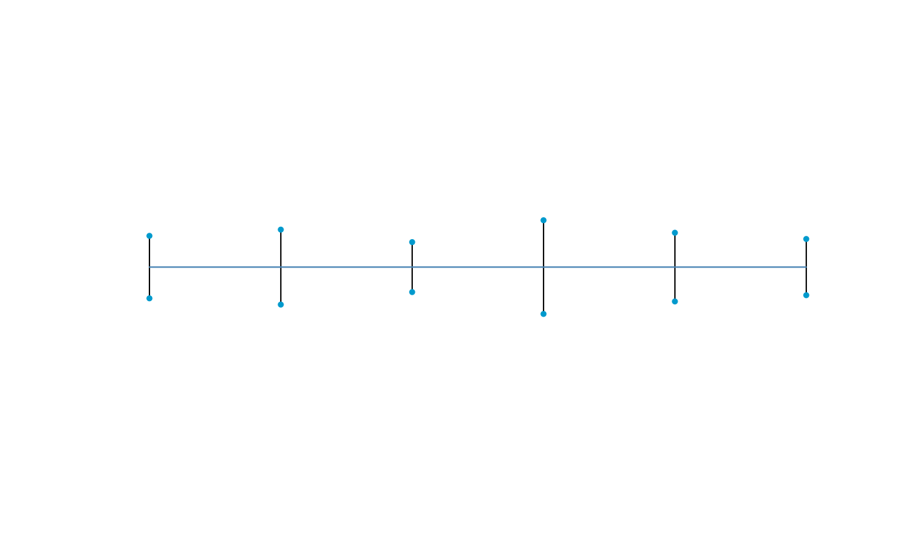
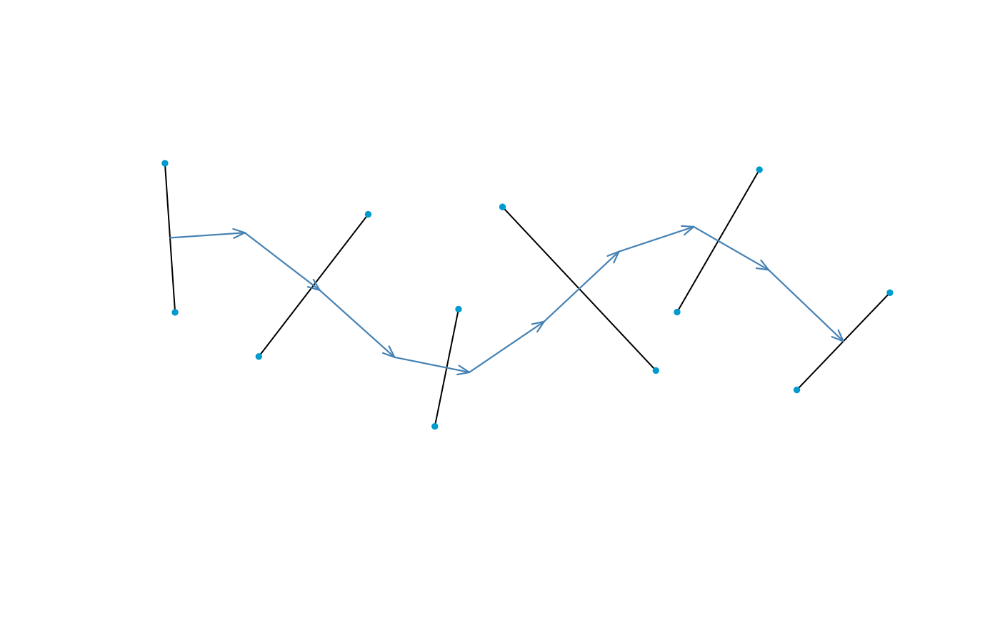
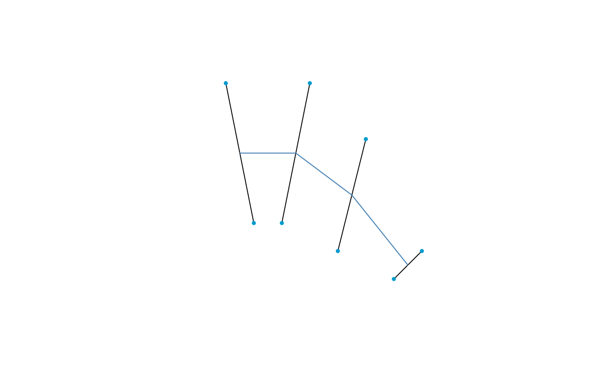
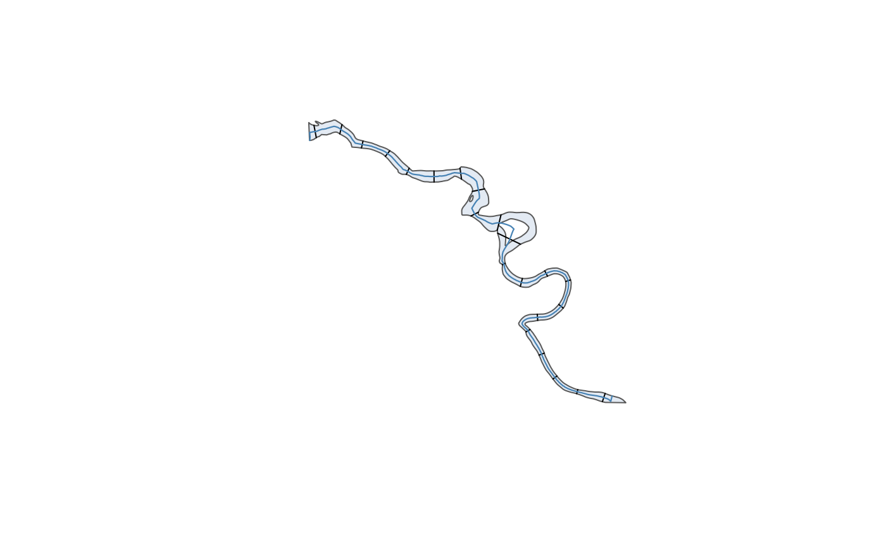
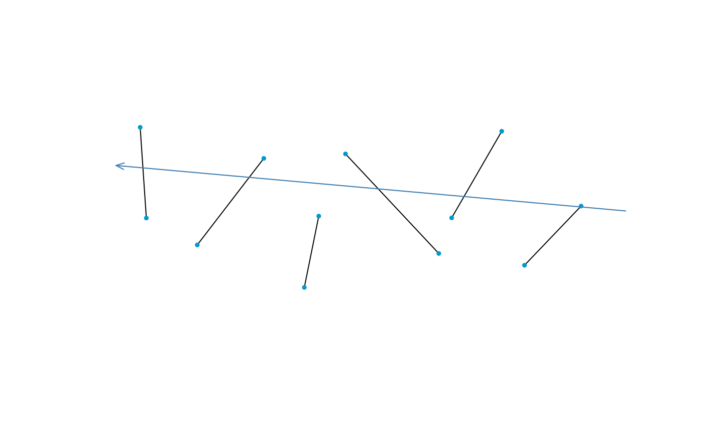
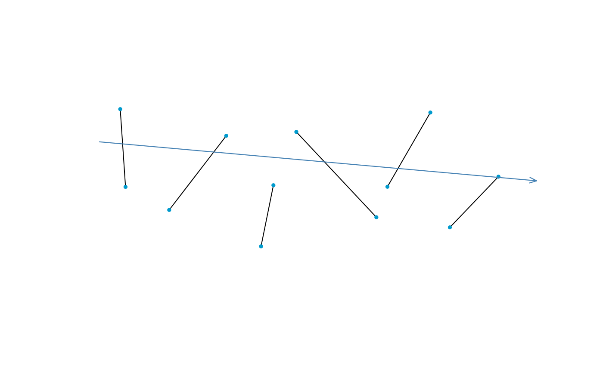
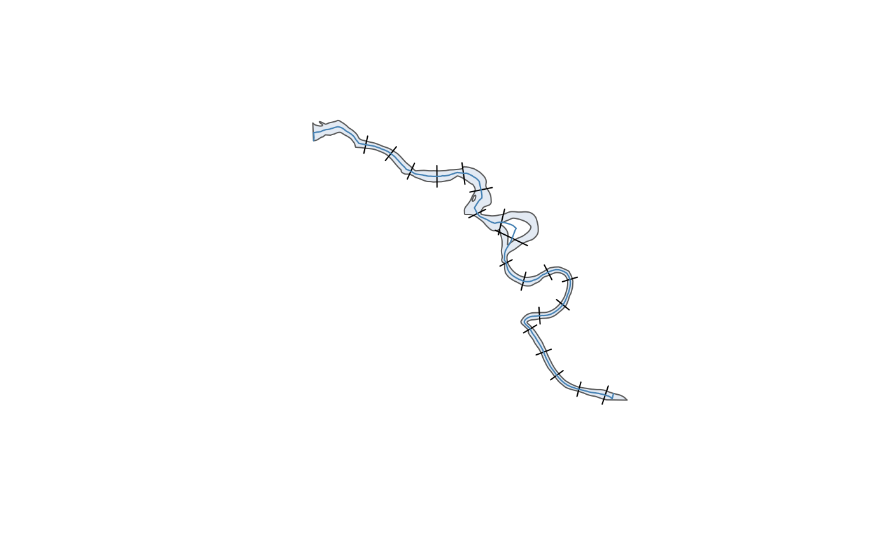

# Getting Started with Channels

Channel objects are encoded as a list of cross sections. This vignette
covers the simple case where cross sections are only planimetric – that
is, they are line segments arranged on a map. Profile geometries are
also allowed; see the [*Channels with
Profiles*](https://fluvtools.github.io/xchan/articles/channels_with_profiles.md)
vignette to see how.

``` r

library(xchan)
```

## Creating Channels by Hand

The simplest way to make a channel is by specifying a vector of widths.
This is useful when the spatial layout of the channel is not important,
for example.

``` r

widths <- c(10, 12, 8, 15, 11, 9)
channel1 <- xt_as_channel(widths)
plot(channel1)
```



There are two main objects in this package:

- A cross section (object of class `"xsection"`)
- A channel (object of class `"xchan"`)

A *cross section* is a linear slice across a river channel, and in this
package, is spatially encoded through a *planimetric* (“plan”) view and,
optionally, a *profile* view.

A *channel* is a list of cross sections, optionally strung together
along a channel *axis* like a centerline.

``` r

channel1
#> xchan channel with 6 cross sections.
#> <xsection 1> 10 (-)
#> <xsection 2> 12 (-)
#> <xsection 3> 8 (-)
#> <xsection 4> 15 (-)
#> <xsection 5> 11 (-)
#> <xsection 6> 9 (-)
```

You could also string those cross sections along a channel axis for a
bit more spatial realism. This axis should be encoded as an `sfc` or
`sfg` object from the [**sf**](https://r-spatial.github.io/sf/) package.

``` r

axis <- sf::st_linestring(
  matrix(c(1:10 * 5, 5 * sin(1:10)), ncol = 2),
  dim = "XY"
)
axis
#> LINESTRING (5 4.207355, 10 4.546487, 15 0.7056, 20 -3.784012, 25 -4.794621, 30 -1.397077, 35 3.284933, 40 4.946791, 45 2.060592, 50 -2.720106)
```

String the original widths along the axis; this time, we’ll also view
the flow direction.

``` r

channel2 <- xt_as_channel(widths, axis = axis)
plot(channel2, axis = "arrows")
```



For more control, you could specify your own cross sections as bespoke
line segments. As usual, make sure these are encoded up as objects with
the [**sf**](https://r-spatial.github.io/sf/) package, this time as
`sfc` objects.

``` r

library(sf)
#> Linking to GEOS 3.12.1, GDAL 3.8.4, PROJ 9.4.0; sf_use_s2() is TRUE
lines <- list(
  st_linestring(matrix(c(-2, -1, 5, 0), ncol = 2)),
  st_linestring(matrix(c(1, 0, 5, 0), ncol = 2)),
  st_linestring(matrix(c(3, 2, 3, -1), ncol = 2)),
  st_linestring(matrix(c(5, 4, -1, -2), ncol = 2))
)
lines_sfc <- st_sfc(lines)
lines_sfc
#> Geometry set for 4 features 
#> Geometry type: LINESTRING
#> Dimension:     XY
#> Bounding box:  xmin: -2 ymin: -2 xmax: 5 ymax: 5
#> CRS:           NA
#> LINESTRING (-2 5, -1 0)
#> LINESTRING (1 5, 0 0)
#> LINESTRING (3 3, 2 -1)
#> LINESTRING (5 -1, 4 -2)
```

``` r

channel3 <- xt_as_channel(lines_sfc)
plot(channel3)
```



Note that an axis is automatically generated in the direction based on
the order the cross sections appear in; if this results in a strange
axis, or your line segments are not in order, it’s a good idea to take
more control of the channel axis – see the [Channel Axes](#channel-axes)
section.

## Creating Channels from Spatial Data

``` r

plot(Squamish_bankline)
```


Cross sections can be auto-generated from the bankline polygon. You can
specify the cross section spacing directly (`spacing`), or by the
desired number of cross sections (`n`). Unlike
[`xt_as_channel()`](https://fluvtools.github.io/xchan/reference/xt_as_channel.md),
which converts cross-section-like objects into cross sections,
[`xt_generate_plan()`](https://fluvtools.github.io/xchan/reference/xt_generate_plan.md)
uses an unrelated object – the bankline polygon – to generate cross
sections.

``` r

squamish <- xt_generate_plan(Squamish_bankline, spacing = 500)
plot(squamish)
```



The algorithm for creating cross sections works by sampling points along
a channel axis, and connecting the two banks according to the shortest
distance. If no axis is supplied, a centerline is delineated using the
[**centerline**](https://cran.r-project.org/package=centerline) package.
If islands are present, they are ignored when calculating bank-to-bank
span; however, the island banks are encoded in the cross sections so
that wetted width can be determined (see the [Channel
Computations](https://fluvtools.github.io/xchan/articles/channel_computations.md)
vignette for more).

It’s worth noting that the algorithm method may produce crossing cross
sections. If that’s a problem, consider hand picking the cross section
locations along the channel axis, or remove the problematic cross
sections. For example, remove the first two cross sections, which appear
to be artifacts of the sampling procedure.

``` r

squamish[1:2] <- NULL
```

## Channel Axes

All channels must have an *axis*. This provides two main structural
components to the channel.

- It controls flow direction, so that a left and right bank can be
  identified.
- It determines cross section ordering.

In addition, many channel computations rely heavily on the channel axis
– see the [Channel
Computations](https://fluvtools.github.io/xchan/articles/channel_computations.md)
vignette for more.

Running a new axis along the cross sections updates the direction of
flow. This is demonstrated below with a new axis directing `channel2`.

``` r

new_axis <- st_linestring(matrix(c(58, 2, 0, 5), ncol = 2))
xt_axis(channel2) <- new_axis
```

This channel now flows towards the left, the opposite of its previous
flow.

``` r

plot(channel2, axis = "arrows")
```



You can also reverse the flow direction directly. This is especially
useful when generating cross sections with
[`xt_generate_plan()`](https://fluvtools.github.io/xchan/reference/xt_generate_plan.md),
in case the algorithm gets the direction wrong.

``` r

channel2 <- xt_reverse_flow(channel2)
plot(channel2, axis = "arrows")
```



It’s important to note that, while a channel is just a list of cross
sections, the order of the cross sections in the list does not influence
flow order! Try it yourself: does `channel2[c(2, 3, 1)]` change the flow
direction and order? The importance of this decoupling is discussed
later when cross sections are placed in a data frame.

## Channel Data Frames

Of course, a river is more than its geometry. Any number of
characteristics could be relevant for an analysis, such as bed
roughness, grain size, or even segment ID. This is why channels are
lists, so that you can pair characteristics to each cross section –
ideally, in a data frame.

Consider `channel2`, which has six cross sections. A data frame (tibble)
can be constructed to pair cross sections with their characteristics.

``` r

tibble::tibble(
  cross_section = channel2,
  roughness = c(0.035, 0.035, 0.03, 0.03, 0.03, 0.025),
  gradient = c(0.01, 0.01, 0.02, 0.02, 0.01, 0.01)
)
#> # A tibble: 6 × 3
#>   cross_section roughness gradient
#>   <xchan>           <dbl>    <dbl>
#> 1 <xsection>        0.035     0.01
#> 2 <xsection>        0.035     0.01
#> 3 <xsection>        0.03      0.02
#> 4 <xsection>        0.03      0.02
#> 5 <xsection>        0.03      0.01
#> 6 <xsection>        0.025     0.01
```

While early development of xchan defined channels as tabular, the mature
version only deals with the single column of cross sections because its
goals are purely spatial. In addition, it’s not obvious how to support
the various ways in which operations can be conducted on a table, like
expanding joins or split-apply-combine strategies often used in
dplyr-like workflows.

## Channel Bankline

Like the [channel axis](#channel-axes), a channel bankline is also
stored with a channel object, as an attribute. However, this attribute
is optional, and is only included for convenience. For example, when
present, it can be included in a plot.

You can get and set a bankline polygon with
[`xt_bankline()`](https://fluvtools.github.io/xchan/reference/xt_bankline.md).
Here is the polygon that was used to create the spatially-derived
channel in the [previous example](#creating-channels-from-spatial-data).

``` r

xt_bankline(squamish)
#> Geometry set for 1 feature 
#> Geometry type: POLYGON
#> Dimension:     XY
#> Bounding box:  xmin: 1193827 ymin: 540227.2 xmax: 1199753 ymax: 545514
#> Projected CRS: NAD83 / BC Albers
#> POLYGON ((1199363 540233.6, 1199335 540240.4, 1...
```

You can also specify the bankline polygon directly whenever coercing
with
[`xt_as_channel()`](https://fluvtools.github.io/xchan/reference/xt_as_channel.md).

## Channel Widening

The
[`xt_widen()`](https://fluvtools.github.io/xchan/reference/xt_widen.md)
function allows you to widen (erode) a channel. Here is the Squamish
River widened by 200 units (meters, in this case).

``` r

squamish2 <- xt_widen(squamish, dw = 200)
plot(squamish2)
```



By default, erosion occurs evenly on both sides. While you can erode the
left bank with `side = "left"` and the right bank with `side = "right"`,
you can also control the distribution between left and right banks by a
`side_` specifier:
[`side_both()`](https://fluvtools.github.io/xchan/reference/sides.md),
[`side_left()`](https://fluvtools.github.io/xchan/reference/sides.md),
and
[`side_right()`](https://fluvtools.github.io/xchan/reference/sides.md).
All three functions do the same thing (specify allocation between left
and right banks), but provide a different approach to this
specification.

For example, here is a 70-30 left-right split of erosion.

``` r

squamish3 <- xt_widen(squamish, dw = 200, side = side_left(0.7))
xt_width(squamish3)
#> Units: [m]
#>  [1] 334.5391 334.1180 328.8095 407.5271 408.5275 431.7100 356.1819 498.2928
#>  [9] 674.6790 259.9702 353.1611 312.8921 294.9426 308.4606 316.3619 289.5777
#> [17] 304.4440 293.3547 279.0400 362.0860
```

Currently only a single proportion is allowed; a future version of xchan
aspires to allow varying proportions along the channel length.

## Exporting Channels

You can export the channel as an object understood by the
[**sf**](https://r-spatial.github.io/sf/) package; the channel will be a
series of line segments. If there are islands, you have the option of
excluding them, resulting in multi-line segments spanning the wet part
of the channel.

``` r

squamish_sf <- xt_as_sfc(squamish, extent = "wetted")
plot(squamish_sf)
```


