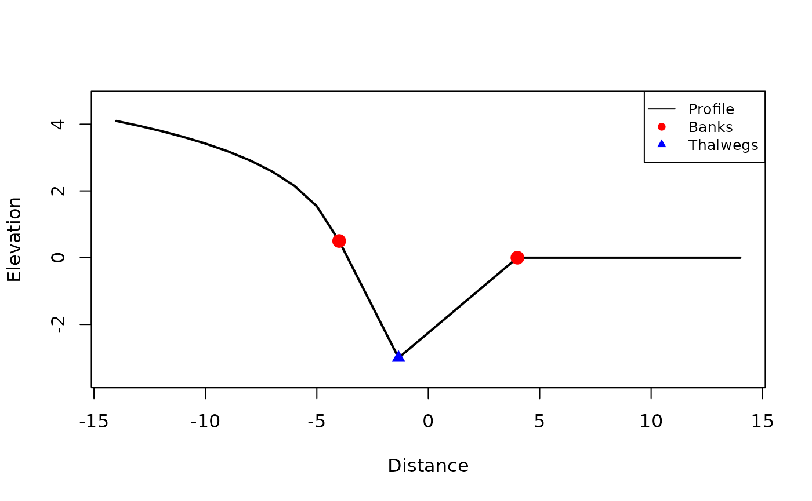
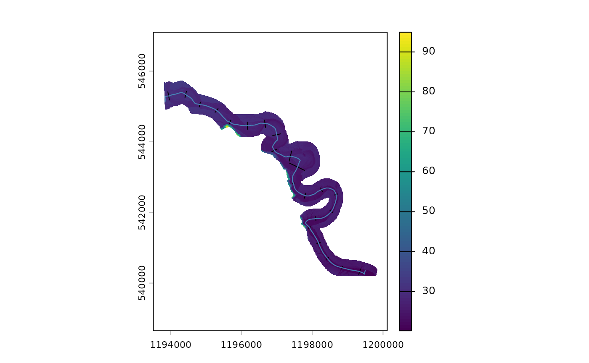
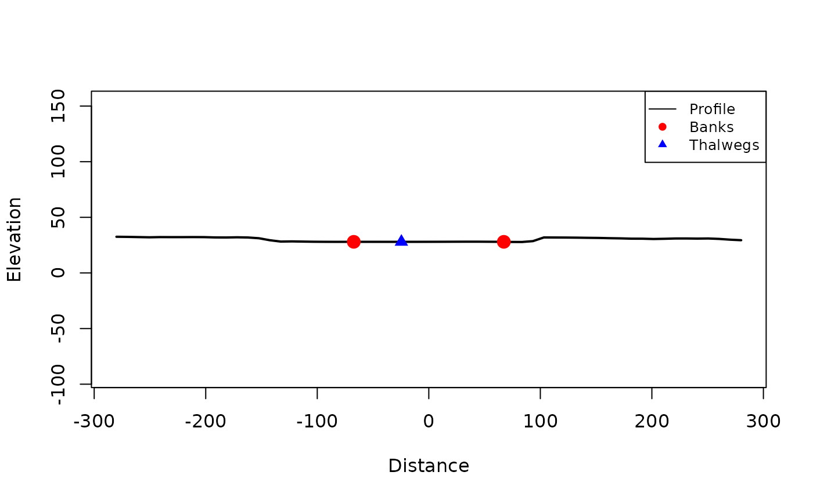
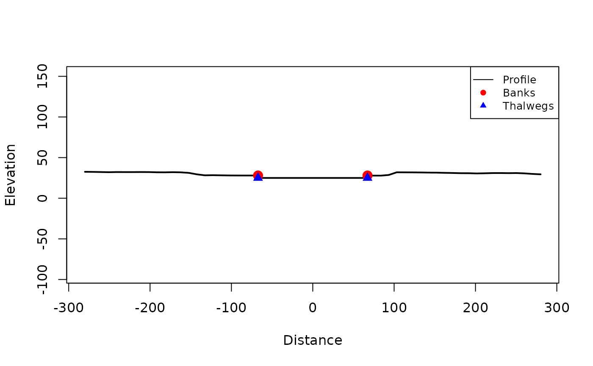
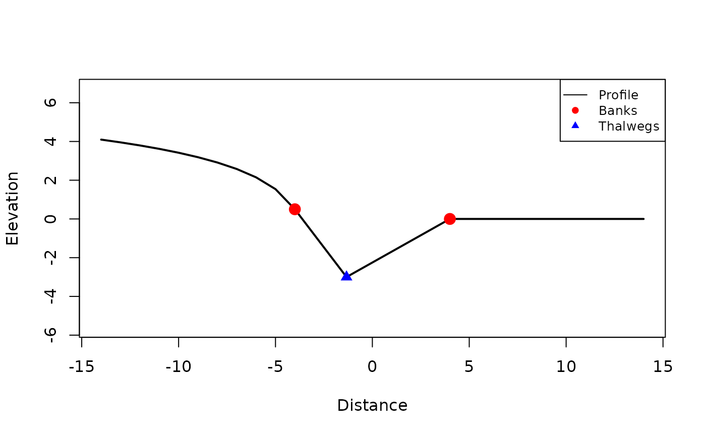
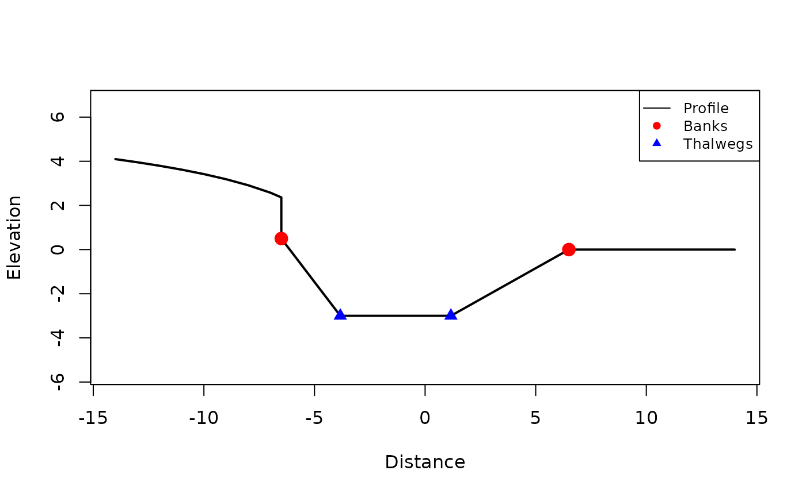
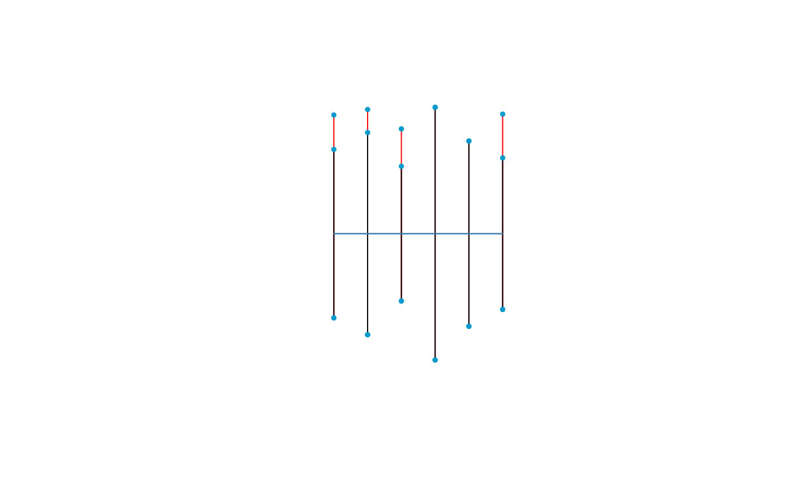

# Channels with Profiles

If your workflow requires profile cross sections, `xchan` allows this in
addition to planimetric encoding. This vignette shows how to create and
work with profile-enabled channels. Since making a channel with profiles
first involves making a channel with planimetric geometries, we
recommend first reading the [*Getting Started with
Channels*](https://fluvtools.github.io/xchan/articles/basic_channels.md)
vignette.

``` r

library(xchan)
```

There are two main ways of creating profile cross sections: by hand, and
from a digital elevation model (DEM).

## Creating Profiles by Hand

Creating profiles by hand is useful when a channel has been surveyed and
the profile data is available in a tabular format. The `profile_survey`
dataset is a toy example of such data.

``` r

head(profile_survey)
#>   id distance elevation is_bank
#> 1  1        0  4.096843   FALSE
#> 2  1        1  3.953878   FALSE
#> 3  1        2  3.795837   FALSE
#> 4  1        3  3.619162   FALSE
#> 5  1        4  3.418865   FALSE
#> 6  1        5  3.187639   FALSE
```

Note the key features of this survey:

- The `id` column is the cross-section key, matching the order of the
  cross sections.
- The `distance` column is the chord distance along the cross section,
  increasing from left bank toward right bank.
- The `elevation` column is the elevation at each marked `distance`.
- The `is_bank` column is a logical flag indicating whether the vertex
  is a bank vertex. There must be an even number of these.

But before we can add profiles to a channel, we need to set the channel
up with its planimetric arrangement. We’ll just consider a straight
channel; at this point, there is no need to ensure that the channel
width matches the survey.

``` r

channel <- xt_as_channel(rep(1, 6))
channel
#> xchan channel with 6 cross sections.
#> <xsection 1> 1 (-)
#> <xsection 2> 1 (-)
#> <xsection 3> 1 (-)
#> <xsection 4> 1 (-)
#> <xsection 5> 1 (-)
#> <xsection 6> 1 (-)
```

Now we can add the profiles to the channel by specifying the required
columns.

``` r

channel <- xt_add_profile(
  channel,
  distance = distance,
  elevation = elevation,
  section = id,
  banks = is_bank,
  data = profile_survey
)
channel
#> xchan channel with 6 cross sections.
#> <xsection 1> 10 m
#> <xsection 2> 12 m
#> <xsection 3> 8 m
#> <xsection 4> 15 m
#> <xsection 5> 11 m
#> <xsection 6> 9 m
#> With profile view
```

Note that the planimetric and profile arrangements are unlikely to have
widths that match exactly. For this, the centerpoint of the planimetric
and profile cross sections are aligned, and one set of banks are moved
to the other set of banks. There are two options:

- `snap_banks_to = "profile"`: The planimetric banks snap to the profile
  banks. This is the default, because the survey is usually the more
  accurate source of information.
- `snap_banks_to = "plan"`: The profile banks snap to the planimetric
  banks.

An important feature of profile-enabled cross sections is that **they
extend outside of the banks**. Here is a planimetric view of the channel
showing the full extent of the cross sections.

``` r

plot(channel, extent = "full")
```


Now it makes more sense to view individual cross sections. Grab an
individual cross section by subsetting the channel list. Here is a view
of the third cross section, with an exaggeration factor of 1.5.

``` r

section <- channel[[3]]
plot(section, extent = "full", exaggerate = 1.5)
```



When plotting cross sections, you can also choose to plot the
planimetric view with `what = "plan"`.

## Creating Profiles from Spatial Data

Sometimes LiDAR data is available in the form of a digital elevation
model (DEM). This can be used to create profile cross sections.

LiDAR for the Squamish River comes shipped with the package as a DEM
from the [**terra**](https://rspatial.org/terra/) package. It needs to
be unpacked first.

``` r

library(terra)
#> terra 1.9.27
squamish_dem <- unwrap(squamish_dem)
```

This can be used together with the river’s bankline polygon to first
generate planimetric cross sections (as we did in the [*Getting Started
with
Channels*](https://fluvtools.github.io/xchan/articles/basic_channels.md)
vignette).

``` r

squamish <- xt_generate_plan(squamish_bankline, spacing = 500)
plot(squamish_dem)
plot(squamish, add = TRUE)
```



Now generate the profile cross sections with
[`xt_generate_profile()`](https://fluvtools.github.io/xchan/reference/xt_generate_profile.md),
using 10 m sample spacing.

``` r

squamish <- xt_generate_profile(squamish, squamish_dem, sample_freq = 10)
plot(squamish)
```


Take a look at the third cross section.

``` r

section <- xt_xsection_at(squamish, 3)
plot(section, extent = "full")
```



## Channel Widening

Channel widening now also applies to the profile cross sections. Widen
the toy channel from before by a range of widths:

``` r

channel_widened <- xt_widen(channel, dw = c(5, 3, 5, 0, 0, 4))
plot(channel_widened, col = "red")
plot(channel, add = TRUE)
```



For cross section profiles, this has the effect of shifting the
between-channel topography on either side of the thalweg further from
the thalweg, spreading out the channel bottom at the thalweg. Here is a
before-and-after view of the third cross section.

``` r

sec <- xt_xsection_at(channel, 3)
sec_widened <- xt_xsection_at(channel_widened, 3)
plot(sec, extent = "full")
```



``` r

plot(sec_widened, extent = "full")
```



Since a profile view is available, there is not only erosion width but
also erosion *volume*.

We can calculate the erosion volume resulting from the above width
change:

``` r

head(xt_erosion_volume(channel, dw = c(5, 3, 5, 0, 0, 4)))
#> Units: [m^3]
#> [1]  8.991580  4.865745 18.991580  0.000000  0.000000 14.863680
```

But we can also erode by volume; here is the resulting width change for
the given cross-section-specific volume change (in squared units), this
time allocating all volume erosion on the left side bank.

``` r

head(xt_erosion_width(channel, dv = c(5, 3, 10, 0, 0, 12), side = "left"))
#> Units: [m]
#> [1] 2.043177 1.369570 2.218729 0.000000 0.000000 2.594431
```

If there is not enough volume to erode, an error is thrown.

Go ahead and conduct the erosion.

``` r

channel_widened2 <- xt_widen(channel, dv = c(5, 3, 10, 0, 0, 12), side = "left")
plot(channel_widened2, col = "red")
plot(channel, add = TRUE)
```



Get the new cross section widths.

``` r

head(xt_width(channel_widened2))
#> Units: [m]
#> [1] 12.04318 13.36957 10.21873 15.00000 11.00000 11.59443
```

## Exporting Channels

With a profile encoding present, the channel can be exported according
to its profiles, or in 3D.

The profile objects all appear overtop of each other:

``` r

profiles <- xt_as_sfc(channel, what = "profile")
plot(profiles)
```


The 3D encoding combines the profile and planimetric views to create a
3D arrangement. Use 3D plotting software like the
[**rgl**](https://rgl.neoscenes.org/) or
[**plotly**](https://plotly.com/r/) packages to view the 3D channel (not
done here because these are not dependencies of the package).

``` r

xt_as_sfc(channel, what = "3d")
#> Geometry set for 6 features 
#> Geometry type: MULTILINESTRING
#> Dimension:     XYZ
#> Bounding box:  xmin: 0 ymin: -7.5 xmax: 10 ymax: 7.5
#> z_range:       zmin: -3 zmax: 0.5
#> CRS:           NA
#> First 5 geometries:
#> MULTILINESTRING Z ((0 5 0.5, 0 1.666667 -1, 0 -...
#> MULTILINESTRING Z ((2 6 0.5, 2 2 -1, 2 -6 0))
#> MULTILINESTRING Z ((4 4 0.5, 4 1.333333 -3, 4 -...
#> MULTILINESTRING Z ((6 7.5 0.5, 6 2.5 -2, 6 -7.5...
#> MULTILINESTRING Z ((8 5.5 0.5, 8 1.833333 -2, 8...
```
